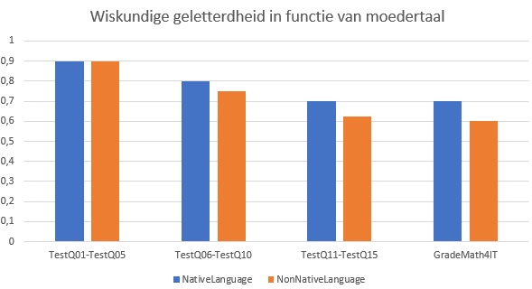
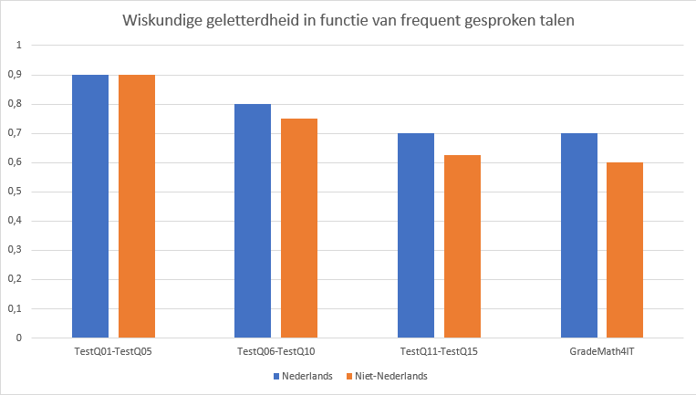
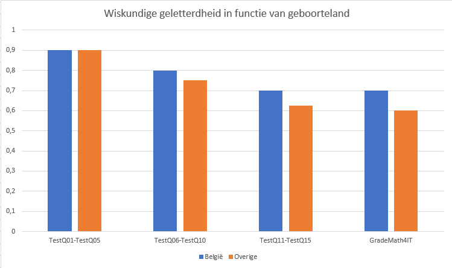

# Hypothese

## Onderzoeksvraag

> Het hebben van een andere moedertaal, frequent een andere taal spreken of land van geboorte, heeft geen invloed op de wiskundige geletterdheid bij studenten in het Vlaamse hoger onderwijs.

## Toelichting

> Een student die Nederlands niet als zijn/haar eigen moedertaal heeft, die frequent een andere taal spreekt of niet in België geboren is, zou hierdoor mogelijks een leerachterstand opbouwen. De Vlaamse hogescholen zien jaarlijks een stijging van studenten die Nederlands niet als hun moedertaal hebben, die thuis geen of minder Nederlands praten of die niet in België geboren zijn. Wij willen met dit onderzoek nagaan of dit ook een invloed kan hebben op de wiskundige geletterdheid van studenten aan het Vlaamse hoger onderwijs. 

## Selectie variabelen

> Onafhankelijke variabele: NativeLanguage, OtherLanguages, BirthCountry

> Afhankelijke variabele: TestQ01-TestQ05, TestQ06-TestQ10, TestQ11-TestQ15, GradeMath4IT

## Schets verwachte resultaten

> Maak een schets van een grafiek die toont hoe jullie verwachten dat de onderzochte factoren invloed hebben op wiskundige geletterdheid.

## Bronnen

> [Wetenschappelijke geletterdheid bij 15-jarigen - Vlaams rapport PISA](https://www.pisa.ugent.be/uploads/assets/140/1485507054477-Vlaams%20rapport%202015(2).pdf)
